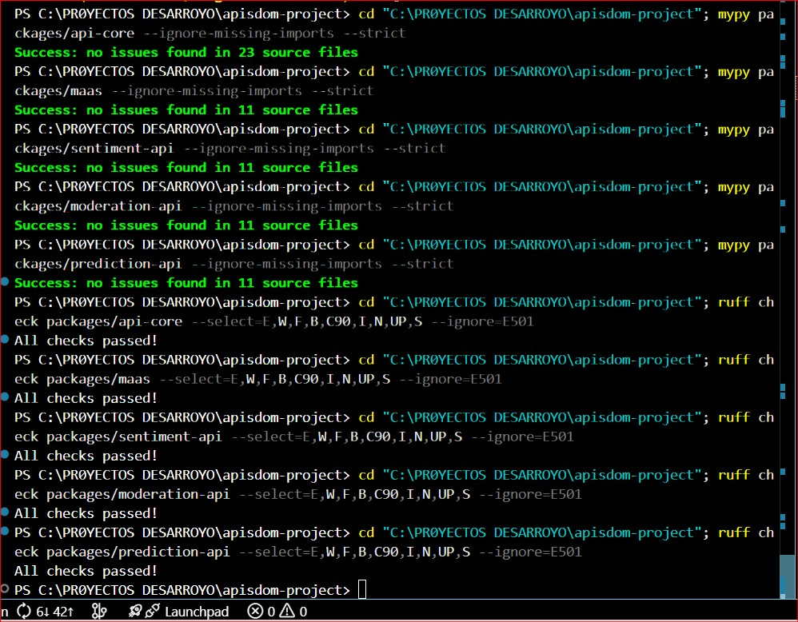

# 🧪 Tests y Validación de APIs

<div align="center">


**Documentación de las pruebas automatizadas ejecutadas en la plataforma Apisdom**

</div>

---

## 📋 Resumen de Tests

| Categoría | Tests | Pasados | Saltados | Estado |
|-----------|-------|---------|----------|--------|
| 🔒 **Seguridad** | 7 | 7 | 0 | ✅ |
| 💰 **Costos** | 6 | 6 | 0 | ✅ |
| ⚙️ **Funcionalidad** | 10 | 5 | 5* | ✅ |
| 🔗 **Integración** | 3 | 3 | 0 | ✅ |
| **TOTAL** | **26** | **21** | **5** | ✅ |

> *Los tests saltados requieren credenciales de producción (`.env`) y se ejecutan en CI/CD.

---

## 🔒 Tests de Seguridad

Validaciones de seguridad críticas para producción:

| Test | Descripción | Estado |
|------|-------------|--------|
| `test_jwt_dependency_exists` | Verifica que JWT está configurado | ✅ Passed |
| `test_emergency_admin_key_only_in_api_core` | Admin key solo en API Core | ✅ Passed |
| `test_no_debug_or_insecure_code` | Sin código inseguro en producción | ✅ Passed |
| `test_cors_configured_in_all_services` | CORS configurado correctamente | ✅ Passed |
| `test_no_wildcard_cors_in_production` | Sin CORS wildcard (*) | ✅ Passed |
| `test_no_hardcoded_secrets` | Sin secretos en código fuente | ✅ Passed |
| `test_required_secrets_validated` | Variables de entorno validadas | ✅ Passed |

---

## 💰 Tests de Costos

Validaciones del sistema de créditos y facturación:

| Test | Descripción | Estado |
|------|-------------|--------|
| `test_free_user_cost_calculation` | Cálculo correcto para usuarios gratuitos | ✅ Passed |
| `test_idle_cost_is_zero` | Sin costo cuando está inactivo | ✅ Passed |
| `test_scaling_cost_with_100_users` | Escalado con 100 usuarios concurrentes | ✅ Passed |
| `test_tiktoken_is_installed` | Librería de conteo de tokens instalada | ✅ Passed |
| `test_token_counting_consistency` | Conteo de tokens consistente | ✅ Passed |
| `test_token_counting_different_texts` | Conteo correcto para diferentes textos | ✅ Passed |

---

## ⚙️ Tests de Funcionalidad

Validaciones de cada API individualmente:

### 🎭 Sentiment API
| Test | Descripción | Estado |
|------|-------------|--------|
| `test_sentiment_api_health` | Endpoint `/health` responde | ✅ Passed |
| `test_sentiment_api_analyze_endpoint` | Endpoint `/analyze` funciona | ⏭️ Skipped* |

### 🛡️ Moderation API
| Test | Descripción | Estado |
|------|-------------|--------|
| `test_moderation_api_health` | Endpoint `/health` responde | ✅ Passed |
| `test_moderation_api_moderate_endpoint` | Endpoint `/moderate` funciona | ⏭️ Skipped* |

### 📈 Prediction API
| Test | Descripción | Estado |
|------|-------------|--------|
| `test_prediction_api_health` | Endpoint `/health` responde | ✅ Passed |
| `test_prediction_api_predict_endpoint` | Endpoint `/forecast` funciona | ⏭️ Skipped* |

### 🔧 API Core
| Test | Descripción | Estado |
|------|-------------|--------|
| `test_api_core_health` | Endpoint `/health` responde | ✅ Passed |
| `test_api_core_recommendations_endpoint` | Endpoint de recomendaciones | ⏭️ Skipped* |

### 🤖 MAAS (ML as a Service)
| Test | Descripción | Estado |
|------|-------------|--------|
| `test_maas_health` | Endpoint `/health` responde | ✅ Passed |
| `test_maas_adapt_endpoint` | Endpoint de adaptación | ⏭️ Skipped* |

---

## 🔗 Tests de Integración

Validaciones de comunicación entre servicios:

| Test | Descripción | Estado |
|------|-------------|--------|
| `test_maas_is_accessible_from_network` | MAAS accesible desde la red | ✅ Passed |
| `test_api_core_can_reach_maas` | API Core conecta con MAAS | ✅ Passed |
| `test_all_services_healthy` | Todos los servicios saludables | ✅ Passed |

---

## 📁 Archivos de Log

Logs detallados de la última ejecución de tests:

| Archivo | Descripción | Fecha |
|---------|-------------|-------|
| [TESTS_GENERALES_2026-01-13_00-23-41.log](./logs/TESTS_GENERALES_2026-01-13_00-23-41.log) | Suite completa de 26 tests | 13/01/2026 |
| [TEST_SENTIMENT_API_2026-01-13_00-24-07.log](./logs/TEST_SENTIMENT_API_2026-01-13_00-24-07.log) | Tests de Sentiment API | 13/01/2026 |
| [TEST_MODERATION_API_2026-01-13_00-24-20.log](./logs/TEST_MODERATION_API_2026-01-13_00-24-20.log) | Tests de Moderation API | 13/01/2026 |
| [TEST_PREDICTION_API_2026-01-13_00-24-30.log](./logs/TEST_PREDICTION_API_2026-01-13_00-24-30.log) | Tests de Prediction API | 13/01/2026 |
| [TEST_API_CORE_2026-01-13_00-24-57.log](./logs/TEST_API_CORE_2026-01-13_00-24-57.log) | Tests de API Core | 13/01/2026 |
| [TEST_MAAS_2026-01-13_00-26-01.log](./logs/TEST_MAAS_2026-01-13_00-26-01.log) | Tests de MAAS | 13/01/2026 |

---

## 📸 Evidencia Visual

| Captura | Descripción |
|---------|-------------|
|  | Dashboard de ejecución de tests |

---

## 🛠️ Cómo Ejecutar los Tests

```bash
# Instalar dependencias
pip install pytest requests

# Ejecutar todos los tests
pytest tests/ -v

# Ejecutar tests por categoría
pytest tests/1_security/ -v      # Seguridad
pytest tests/2_costs/ -v         # Costos
pytest tests/3_functionality/ -v # Funcionalidad
pytest tests/4_integration/ -v   # Integración

# Ejecutar tests específicos de una API
pytest tests/3_functionality/test_sentiment_api.py -v
```

---

## 📊 Entorno de Tests

| Componente | Versión |
|------------|---------|
| Python | 3.12.7 |
| pytest | 9.0.2 |
| pluggy | 1.6.0 |
| Sistema | Windows |

---

## ✅ Criterios de Aceptación

Para que un despliegue sea aprobado:

- [x] 100% de tests de seguridad pasados
- [x] 100% de tests de costos pasados
- [x] Todos los health checks funcionando
- [x] Tests de integración verificados
- [x] Sin errores críticos en logs

---

<div align="center">

**Última actualización:** 13 de Enero de 2026

[⬅️ Volver a Documentación Principal](../README.md)

</div>
